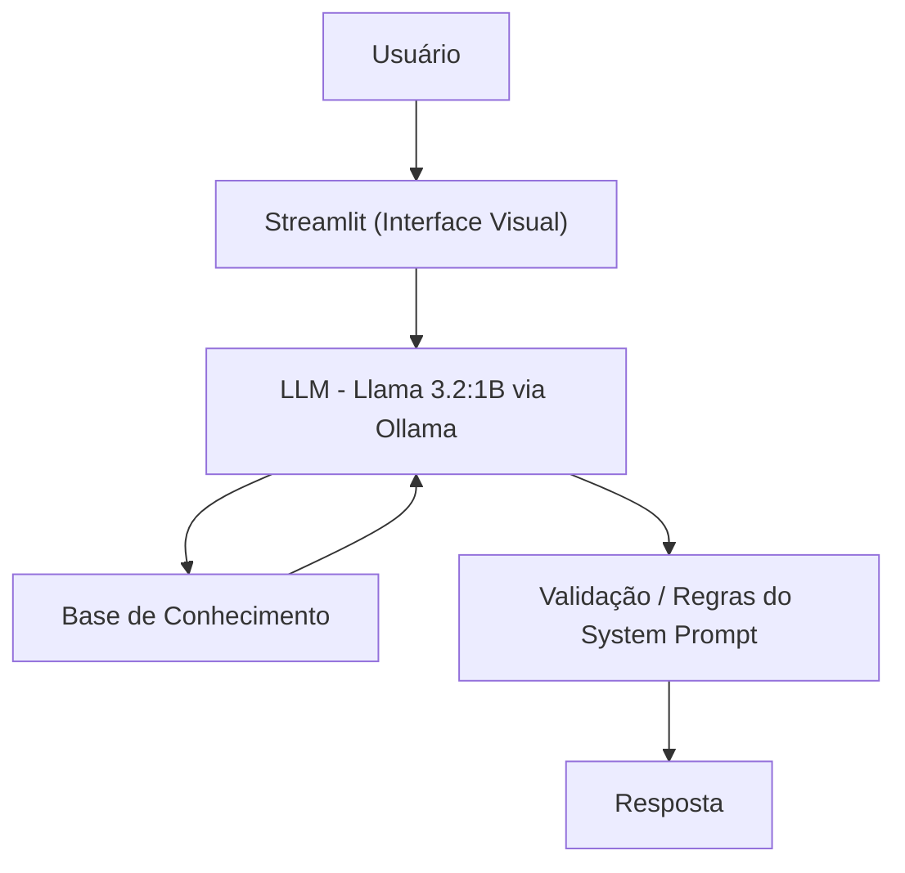

# 💰 FinGuide IA

Assistente virtual de **educação financeira**, desenvolvido no lab da Digital Innovation One (DIO). O agente explica conceitos de finanças pessoais de forma simples e didática, usando os dados do próprio cliente como exemplo — sem nunca recomendar investimentos.

## O que ele faz

- Explica conceitos financeiros (Tesouro Selic, CDI, CDB, FII etc.) em linguagem simples
- Usa o perfil, os gastos e o histórico do cliente para dar exemplos personalizados
- Recusa perguntas fora do escopo de finanças e nunca acessa dados sensíveis
- Admite quando não tem uma informação, em vez de inventar respostas

## Como funciona



- **Interface:** [Streamlit](https://streamlit.io/)
- **LLM:** Ollama, rodando localmente com o modelo `llama3.2:1b`
- **Base de conhecimento:** arquivos JSON/CSV mockados (`data/`), carregados e injetados no prompt

## Estrutura do projeto

```
├── data/                          # Dados mockados do cliente
│   ├── perfil_investidor.json
│   ├── transacoes.csv
│   ├── historico_atendimento.csv
│   └── produtos_financeiros.json
├── docs/                          # Documentação de cada etapa do desafio
│   ├── 01-documentacao-agente.md  # Caso de uso, persona e arquitetura
│   ├── 02-base-conhecimento.md    # Estratégia de dados e contexto enviado ao LLM
│   ├── 03-prompts.md              # System prompt, exemplos e comparação entre modelos de IA
│   ├── 04-metricas.md             # Critérios de avaliação e casos de teste
│   └── 05-pitch.md                # Roteiro de apresentação do projeto
└── src/
    └── app.py                     # Aplicação (Streamlit + Ollama)
```

## Documentação

Todo o desenvolvimento foi registrado passo a passo na pasta [`docs/`](./docs/):

1. **Documentação do agente** — define o problema, a persona do FinGuide IA e a arquitetura da solução.
2. **Base de conhecimento** — detalha os dados usados e como são montados no contexto enviado ao modelo.
3. **Prompts** — traz o system prompt final, exemplos de interação, edge cases e uma comparação entre ChatGPT, Gemini, Copilot e Claude testando as mesmas regras.
4. **Métricas** — define critérios de avaliação (assertividade, segurança, coerência) e os casos de teste aplicados.
5. **Pitch** — roteiro de apresentação de 3 minutos do projeto.

## Como rodar

```bash
git clone https://github.com/AlsS99/dio-lab-bia-do-futuro.git
cd dio-lab-bia-do-futuro
pip install streamlit pandas requests

# É necessário ter o Ollama instalado e o modelo baixado:
ollama pull llama3.2:1b

streamlit run src/app.py
```

## Tecnologias

- Python 3
- Streamlit
- Ollama
- Llama 3.2:1B
- Pandas
- Requests
- JSON

## Principais aprendizados

- Estruturar uma base de conhecimento e injetá-la no contexto do LLM
- Escrever um system prompt com regras claras para evitar alucinações e respostas fora de escopo
- Avaliar o mesmo agente em diferentes modelos de IA e comparar aderência às regras
- Definir métricas objetivas (taxa de acerto, alucinação, escopo, proteção de dados) para validar o agente


Toda a documentação técnica, estratégias de prompt e casos de teste estão disponíveis na pasta [`docs/`](./docs/).
